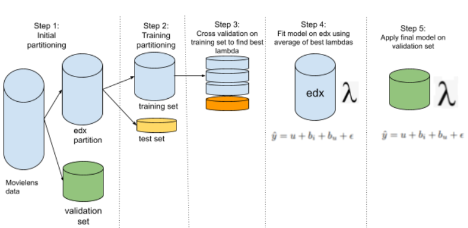

  
  
  
```{r echo=FALSE, message=FALSE, include=FALSE}

knitr::opts_chunk$set(echo = FALSE)

```


```{r 01_source_include, echo=FALSE, message=FALSE, include=FALSE}

  knitr::opts_chunk$set(message=FALSE)
  knitr::opts_chunk$set(warning=FALSE)
  knitr::opts_chunk$set(echo = FALSE) ## do not show code unless told to
  knitr::opts_chunk$set(comment = "") ## remove the # from output 
 
  # the almighty tidyverse, you can't do without
  if (!require(tidyverse)) install.packages("tidyverse", repos = "http://cran.us.r-project.org")
  
  # the beautiful colorbrewer, bring life to your charts
  if (!require(RColorBrewer)) install.packages("RColorBrewer", repos = "http://cran.us.r-project.org")
  
  # for LaTeX (pdf) compilation
  if(!require(tinytex)) {
    install.packages("tinytex", repos = "http://cran.us.r-project.org")
    tinytex::install_tinytex()  # install TinyTeX
  }
  
  # for the amazing tables package by Hao Zhu
  if(!require(kableExtra)) install.packages("kableExtra", repos = "http://cran.us.r-project.org")
  
  
  library(dplyr)
  library(ggplot2)
  library(RColorBrewer)
  library(tinytex)
  library(kableExtra)
  library(gridExtra)

  
  set.seed(1, sample.kind="Rounding") 
  
  ################################################################################
  # read the data files needed for report. 
  # these should have been generated in the rda folder by running the model
  ################################################################################

  rda_path <- "rda"

  # load datasets
  # this is the original edx dataset
  edx_original <- readRDS(file.path( rda_path, "edx.rda"))

```


```{r my_custom_themes}
    
    #########################################################################
    # my custom bar chart theme
    #########################################################################
    
    #plot.title
    chart_main_title_theme <- theme(plot.title = element_text(size = 10))
    
    #axis title and text
    chart_axis_theme <-  theme(axis.title =  element_text(face = "bold"),
                                axis.text = element_text(size = 10) ) 
                             
    angled_30_x_axis_labels_theme <- theme(axis.text.x = element_text(angle = 30, vjust=.8, hjust=0.8))
    angled_45_x_axis_labels_theme <- theme(axis.text.x = element_text(angle = 45, vjust=.8, hjust=0.8) )
    angled_90_x_axis_labels_theme <- theme(axis.text.x = element_text(angle = 90) )
    
    classic_chart_theme <- theme_classic() + chart_main_title_theme + chart_axis_theme
    
    gray_chart_theme <- theme_gray() + chart_main_title_theme + chart_axis_theme 
    
    minimal_chart_theme <- theme_minimal() + chart_main_title_theme + chart_axis_theme
    
    gray_chart_theme_45 <- theme_gray() + chart_main_title_theme +
      chart_axis_theme + angled_45_x_axis_labels_theme
    
    #################################################
    ##
    ## http://applied-r.com/rcolorbrewer-palettes/
    ## 
    ## set color palette:
    ##  - scale_fill_brewer(palette = "RdYlGn") 
    ##  - scale_fill_manual(values = my_colors_17) 
    ##
    ## display.brewer.pal(7,"BrBG")
    ## brewer.pal(7,"BrBG")
    ##
    # create my own color palette for long categorical list
    # pick similar color blind friendly from different palettes
    
    my_colors_20 <- c("#8DD3C7", "#FFFFB3", "#BEBADA", "#FB8072", "#80B1D3", "#FDB462", "#B3DE69", 
                      "#FCCDE5", "#FEE0D2", "#D9D9D9", "#BC80BD", "#CCEBC5", "#FFED6F", "#31A354",
                       "#034E7B", "#006837","#D95F0E" ,"#993404", "#3690C0" ,"#0570B0")

    
    my_colors_8<-c("#F4A582", "#92C5DE","#66C2A5", "#A6D854","#FFD92F", "#66BD63", "#1A9850", "#FDAE61", "#D9EF8B")
    

```


## Introduction

In this project, I present a movie recommendation system that can be used for predicting movie ratings. Recommendation systems are used by companies such as Netflix, Amazon, and other large online retailers to suggest items for users based on some parameters. For instance, items can be suggested to users based on popularity. In the case of movie recommendation, we could assume that a user might like a movie simply because many people like that movie.  In other cases we could analyze user profiles for attributes such as gender, age group, etc. to find similarities among users and recommend items based on their similarities. For instance, we might recommend Horror movies to males if our analysis reveal that males tend to watch more Horror movies than females. 

In our dataset, we have a selected number of users and a set of movies. Not all users have watched or rated every movie. In fact, no single user has rated every movie. The challenge here is to assign (predict) ratings to movies that a user has not rated. The assumption here is that a higher rating means the user liked the movie. Therefore, if our prediction assigns a high rating to a movie for a user, we take that to mean the user will most likely like that movie, hence, we can recommend that movie to the user.


\newpage


### Source Code and Repository
The source code for the entire project can be found on github at 
https://github.com/kowusu01/KOwusu.Tieku.HarvardX.Capstone.Movielens


### Development Environment Used
OS: Windows 10 x64 (build 19041)  
Machine: Dell Latitude, i5 Dual Core @ 2.4GHz and 2.5GHz  
Memory: 16GB  
R: version 4.1.2 (2021-11-01)  

\newpage


## The Dataset
The dataset used in this project is the ml-10m.zip containing 10million records. This dataset can be found at http://files.grouplens.org/datasets/movielens/ml-10m.zip.
As per standard data science practice, the data has been partitioned into training (the edx set), and hold-out (validation set). All training and tuning will be peformed on the edx set.

## Quick Glance at the Dataset
To begin the analysis, the movielens data is downloaded and unzipped. There are two important files in this download - movies.dat and ratings.dat. These files can be viewed using any standard text viewer.

**movies.dat**   
  A quick peek at the __movies.dat__ shows that the file is a delimeted with double colon (::) as the separator. Each line is unique movie having the movieId, the title, and the list of genres for that movie. Notice that the genre is also a delimeted string with | as the separator.   


**ratings.dat**   
  The next file in the downloaded zip is the __ratings.dat__. This file contains each rating a user has given a movie. Again this is a delimited file with :: as the separator. Each line contains userId, the movieId, the rating that was provided, and the timestamp.   
\newpage

## Data Wrangling

### Required Wrangling
In the dataset, each rating is an observation, therefore the data in the _ratings.dat_ is joined with the dataset in the _movies.dat_. After some data wrangling, the resulting data looks as below. All features are converted to the appropriate types. For instance, the movieId and userId must be converted from character to numeric. The movie title and genres by default might be loaded as factors; they are converted to characters. The following table shows a sample of the data after initial wrangling.      


```{r r_chunk_glimpse_of_original_dataset}

glimpse(edx_original)

edx_original[1:9, ] %>% 
kbl(booktabs = T,  caption = 'Sample records after joining movies and ratings') %>%
  kable_styling(latex_options = c("striped", "hold_position"))

rm(edx_original)

```

### Additional Wrangling
The following data wrangling tasks were performed.

#### Split Movie Genres.
The movie genre column is also broken down into individual items and added as dummy variables. For instance, if a movie is listed under genres Action and Comedy, it will have 1 under those two columns and 0 for the rest.

#### Fixing Problematic Genre Names.
Close inspection of the genres also revealed that some genres contain hyphens which could cause problems when used as variables names. These genres are __'Sci-Fi'__ and __'Film-Noir'__. The hyphens were removed. Another genre,  __'(no genres listed)'__ contain spaces and could cause problems later. The genre was renamed to _NoGenres_.
The code used to perform that task is is listed below:
  
\newpage
  
```{r  r_chunk_process_genres, eval=FALSE, echo=TRUE}

###############################################################
# split genres and create column for each genre
###############################################################
fnProcessGenres <- function(dataset){
  
  dataset <- dataset %>% mutate(genre = str_split(genres, "\\|" )) %>%
    unnest(cols = genre) %>% mutate(is_used=1)
  dataset <- dataset %>%
    pivot_wider(names_from = genre, values_from=is_used, values_fill = 0)
  
  (genre_names <- names(dataset))
  
  ## rename the following genres
  
  if(which(genre_names == "Sci-Fi") > 0)
    names(dataset)[which(genre_names == "Sci-Fi")] <- "SciFi"
  
  if (which(genre_names == "Film-Noir") > 0)
    names(dataset)[which(genre_names == "Film-Noir")] <- "FilmNoir"
  
  if(which(genre_names == "(no genres listed)") > 0)
    names(dataset)[which(genre_names == "(no genres listed)")] <- "NoGenre"
  
  dataset %>% select(-c("genres") )
  
}


# 1. split genres into columns and add to the dataset
edx <- fnProcessGenres(edx)

# 2. extract movie release year from titles
edx <-  edx %>%
  mutate(release_year = str_extract_all(title, pattern = "\\(\\d{4}\\)")) 

edx$release_year <- edx$release_year %>% str_replace(pattern= "\\(", "")
edx$release_year <- edx$release_year %>% str_replace(pattern= "\\)", "")
edx <- edx %>% mutate(release_year = as.integer(release_year))

# convert review timestamp to datetime 
edx <- edx %>% mutate(timestamp = as_datetime(timestamp))

```

\newpage
The following table shows the data after the wrangling.

```{r r_chunk_sample_data_after_wrangling}

  # load the data after all the wrangling is done
  edx <- readRDS( file.path( rda_path, "edx_v1.rda"))
  glimpse(edx)

```


\newpage

## Data Exploratory
In this section, I explore the data to gain understanding of the general properties of the data. In most cases, I will be exploring the training data(edx) because it is assumed that the data distribution is very similar, if not the same in both training and validation sets.  The next table shows the total number of records, the total number of users, number of movies in both the training and validation datasets.  

Before exploring, I ask a few questions that I attempt to answer using the data. 

* For instance, what are the patterns in the user rating? 
* What are the top most rated movies?
* Who are the most active users in terms of number of rating?
* Do some people just give 5-star rating to every movie and others just rating every movie poorly?
* What is the overall rating average for all movies? What are the average rating per movie and per user?
* If we assume users rate their movies the same day after they watch it, are there any trends in the days the movies are watched (rated)? For instance, do movies rated on weekends have favorable ratings than those rated during the week?

The following table shows the total number of records, the total number of users, number of movies in both the training and validation datasets.  


```{r r_chunk_num_records, echo=FALSE, message=FALSE, warning=FALSE}

validation <- readRDS(file.path(rda_path, "validation.rda"))
col1 <- c("Unique Records", "Unique Users", "Unique Movies")
col2 <- c(nrow(edx), n_distinct(edx$userId),n_distinct(edx$movieId)) ## edx
col3 <- c(nrow(validation),  n_distinct(validation$userId), n_distinct(validation$movieId)) ## validation

kbl(data.frame(Item=col1, TrainingSet = col2, ValidationSet=col3), 
    booktabs = T,
    caption = 'Items Count in the Datasets') %>%
  kable_styling(latex_options = c("striped", "hold_position"))


```


### Null Values
A simple query to the training dataframe shows that there are no null (NA) values in either the edx or validation datasets. This is good news since we don't need to exclude any invalid data.


```{r r_chunk_NA_ccheks, echo=TRUE}
  sum( is.na(edx) )
  sum( is.na(validation) )
```
\newpage

### Overall Mean, Median
Using the unique() and the summary() functions, we see that overall there are ten unique ratings, given by users with a minimum of ```r min(edx$rating) ``` and max of ```r max(edx$rating) ```. No rating of zero (0) is given. The overall mean for movie rating is ```r round(mean(edx$rating),2) ```, with a median of ```r median(edx$rating) ```. This means most users seem to be generous and give pretty high ratings with __4.0__ being the most predominant rating.


```{r r_chunk_unique_ratings, echo=TRUE}

unique(edx$rating) %>% sort()
summary(edx$rating)

```

The rating distribution can also be visualized using a simple histogram.   

```{r r_chunk_rating_distribution_histogram., echo=TRUE}

edx %>% group_by(rating) %>% summarise(n=n()) %>% 
  select(rating, n) %>%
  mutate(rating = factor(rating)) %>% 
  ggplot() + aes(x=rating, y=n, fill=rating) + geom_col() + 
        scale_fill_manual(values = my_colors_20)   +
  labs(title = 'Rating Distribution in the Training (edx) Dataset',
       x="Rating", y="Count") + 
  theme_classic()


```

\newpage

Another easy way to visualize the distribution is to plot a sample rating. A small sample of 1000 random observations confirm that 3.0, 4.0, and 5.0 are the most common ratings as indicated by the almost solid lines on the plot below.

```{r r_chunk_random_1000_movies, echo=TRUE}

sample.size <- 1000
sample.data <- sample_n(edx, sample.size) %>% 
  select(rating) %>% 
  mutate(x = seq(1:sample.size))

sample.data %>% ggplot() +
  geom_point(aes(x = x, y = rating), show.legend = FALSE) + 
  labs(title = 'Rating Distribution for 1000 Random Observations', x = "observations", y="rating") 
  
``` 

\newpage

### Variations in Users Rating Behavior 
We know from experience that users exhibit different behaviors when it comes to rating items, whether it's movies, items purchased or whatever. For some users, ratings movies may be habitual, meaning they rate almost every movie they watch, others rate only those movies they likes, while others only rate movies they really hated just to warn other people. Of course, there are some users who don't rate at all. 

Among users who make the effort to rate movies, some are very generous and give every movie a 5 star rating, others may give a poor or average rating to every movie. These differences are called biases; the exact reasons for these biases are not known, buts it's important to be aware of them when making predictions about how users may rate future movies. In this section, I explore the data to find some of these biases. 

### Most Active Users vs Least Active Users
I have selected top ten most active users and ten least active users by number of rating and shown in the table. From the table, we see a huge difference in the number of movies rated between the two groups with most active users in thousands while least active users in tens. There is also a difference in average ratings with some of the least active users having even higher averages than active users. This is important to note because users with few ratings may be outliers and can affect our predictions. 

```{r r_chunk_avg_rating_per_users, echo=FALSE, message=FALSE, warning=FALSE}

avg_rating_per_users  <-  edx %>%   
  group_by(userId) %>%  
  summarise(num_ratings=n()) 
  
## slice the top 10 to display in a table
kbl(rbind(avg_rating_per_users %>% arrange(desc(num_ratings)) %>% slice(1:10), 
          avg_rating_per_users %>%arrange(num_ratings)        %>% slice(1:10)), 
    booktabs = T,
    caption = '10 Most Active and 10 Least Active Users by No. of Ratings') %>%
  kable_styling(latex_options = c("striped", "hold_position")) %>% 
  pack_rows("Most Active", 1, 10) %>% 
  pack_rows("Least Active", 11, 20)


```
\newpage


### Most Rated and Least rated Movies

The same is done for movies; the top and bottom ten movies by number of ratings are shown below in the table. Again, we see a vast difference in the the two groups. Some movies in the least rated group received only one rating while those in the most rated group have received tens of thousands of ratings. So there is potential outliers here. 
 
  
```{r r_chunk_avg_ratings_per_movie, echo=FALSE, message=FALSE, warning=FALSE}

ratings_by_movie  <-  edx %>%   
  group_by(movieId) %>%  
  summarise(num_ratings=n()) 

rbind(
      ratings_by_movie %>%  arrange(desc(num_ratings)) %>% slice(1:10), 
      ratings_by_movie %>%  arrange(num_ratings) %>% slice(1:10)) %>% 
select(movieId, num_ratings) %>% 
kbl( booktabs = T,
    caption = 'Ten Most Rated and Ten Least Rated Movies by No. of Ratings') %>%
  kable_styling(latex_options = c("striped", "hold_position")) %>% 
  pack_rows("Most Rated", 1, 10) %>% 
  pack_rows("Least Rated", 11, 20)


```

\newpage


### Most Rated Movies   
To get an idea of most rated movies based on average rating, I exclude movies that have received less than 50 ratings. This provides a better view of what users think are the best movies. 

```{r r_chunk_top10_movies_by_rating, echo=FALSE, message=FALSE, warning=FALSE}

distinct_movies <- edx %>% select(movieId, title) %>%  distinct()

edx %>%   
  group_by(movieId) %>%  filter(n() > 50 ) %>% 
  summarise(avg_rating = mean(rating)) %>% 
  arrange(desc(avg_rating)) %>% slice(1:10) %>% 
  left_join(distinct_movies, by = "movieId") %>% 
  select(movieId, avg_rating, title) %>% 
  kbl( booktabs = T,
    caption = 'Top 10 Movies by Avg. Ratings') %>%
  kable_styling(latex_options = c("striped", "hold_position"))
  
```

### Ratings Distribution Based on Movie Release Year

#### Number of Rating Per Release Year.   
From the data, the ratings are not evenly distributed based movie release year. As seen  from the table below some movies released in certain years receive more ratings than others. In general, the number of ratings are increasing with time, with most rating being given to movies released in the 90s. In fact 1995 movies have the most rating than all years. However, as the graph shows, the number of ratings start to decrease for more recent movies (after 1995). The decrease in the number of rating for the newer movies may be due to the fact that most people have not seen them yet. 


```{r r_chunk_ratings_per_release_year, echo=FALSE, message=FALSE, warning=FALSE, out.height="40%"}

rating_per_year  <-  edx %>%
  group_by(release_year) %>%  
  filter(n() > 50)  %>% 
  summarise(n=n(), avg_rating = mean(rating))

rating_per_year %>% 
  ggplot(aes(x=release_year, y=n)) + geom_bar(stat = "identity") +
  scale_y_continuous(trans='log2') + labs(title = 'No. of Ratings (Based on Movie Release Year)', x="Year",  y = "No. of Ratings (log2)")
```

### Some users give higher ratings than others 
As an illustration, I selected four random movies and two users who have watched all four movies and observed their rating. See the table and chart below. From the chart, user __18__ gives higher ratings to all four movies than user __8__.

```{r r_chunk_bias_example_1, fig.align='left'}
  
  readRDS(file.path(rda_path, "user_bias_table1.rda")) %>% 
    kbl( booktabs = T) %>%
    kable_styling(latex_options = c("striped", "hold_position")) %>%
    add_header_above(c(" ", "User Ratings" = 4))
  
  readRDS(file.path(rda_path, "user_bias_chart1.rda"))

```
### Some users give the same rating to every movie
Another form of bias result from some users tendency to give the same rating to every movie. When a user gives the same rating to every movie, the variation (the standard deviation) is zero. This type of data is not useful for algorithms looking fr patterns and such data is often removed from the dataset.  

Here I start by computing the standard deviation for each user's ratings and plot a sample of it.

\newpage

```{r r_chunk_code_users_rating_deviations, echo=TRUE, eval=FALSE}
  
  # user bias - some users tend to give the same rating for every movie regardless
  
  # we start by calculating standard deviations for each user's ratings
  user_rating_sds <- edx %>% select(userId, movieId, rating) %>% group_by(userId) %>% 
    summarise(n=n(), sd=sd(rating)) %>% arrange(desc(sd))
  
  # see users and the standard deviation in their ratings
  user_rating_sds %>% select(userId, sd) %>% arrange((sd)) %>% slice(1:1000) %>% view()
  
  # now lets plot a sample of the standard deviations
  sd_sample_index <- sample(nrow(user_rating_sds), 50000)
  sd_sample <- user_rating_sds[sd_sample_index, ]
  
  sd_sample <- sd_sample %>% 
    mutate(level_of_deviation=if_else(sd==0, "no_variation", if_else(sd<=0.5, "low_variation", 
                              if_else(sd<=1.5, "medium_variation", "high_variation"))))
  
  ratings_sd_chart <- sd_sample %>% ggplot(aes(x=factor(userId), y=sd)) + 
    geom_point(aes(color=level_of_deviation)) + 
    labs(title = "Levels of deviation (stanbdard deviation for user ratings)") +
    ylab("stanard deviation") + xlab("") +
    theme(axis.text.x=element_blank())

```


```{r r_chunk_display_user_ratings_standard_deviations}
  
  readRDS(file.path(rda_path,"ratings_sd_chart.rda")) 

```


From the chart above we see that the majority of the user ratings have variations (standard deviation) between __0.5__ and __1.5__. 
There are obviously some with  no variation (standard deviation of 0, as seen at the bottom part of the chart), and some are above __2.0__.

Exploring further, the users that give same ratings are identified. The table below show al the users with zero standard deviations and their ratings, including how many movies each has rated.

```{r r_chunk_all_zero_sd_users}

  readRDS("rda/users_with_zero_sds.rda") %>% 
    kbl( booktabs = T, caption = "Users with zero standard deviations in ratings") %>%
    kable_styling(latex_options = c("striped", "hold_position")) 

```

From the table above, it's clear that the number of users with zero standard deviation is a tiny percentage compared to the thousands of users in the dataset. 

\newpage


### Movie Genres
Movie genres can also influence movie ratings. Some people like Action movies while others like Comedy. In this analysis, an attempt will be made to factor in the effect of genre in our model. The following table shows the frequency of each genre in the edx dataset. 

   
As mentioned in the Data Wrangling section, I broke down the genres column into the individual genres. 


   
```{r sample_individual_genres_table, message=FALSE, warning=FALSE}

edx %>% select(userId, movieId, rating, Comedy, Drama, Action, Thriller, Adventure, Crime, Romance, War) %>% head(10) %>% 
 kbl( booktabs = T,
    caption = 'Movies with Sample Genres') %>%
  kable_styling(latex_options = c("striped", "hold_position")) %>%  kable_styling(latex_options="scale_down")
  
```
From the table and the graph below, it can be seen that Drama and Comedy are the most frequent genres in the dataset than any other genre. Genres such as Western, Film Noir, and Documentary are less common.   
```{r}

 ## genres matrix
  # the genres have already been added as columns to the edx dataset
  # remove the other column and create a matrix containing only the genres
  
  # 1.extract the genres columns from the edx dataset (by excluding other columns)
  genres <- edx[, 7:26]
  
  # 2. convert the genres into a matrix
  genres.matrix <- genres %>% data.matrix(row.names(genres))
  
  # 3. compute the sums for each genre
  genres_totals <- colSums(genres.matrix) %>%  as.vector()
  
  # 4. prepare the data for a chart
  cols.names <- colnames(genres)
  genres_df <- data.frame(genre = factor(cols.names), total = genres_totals)
  
  ## 5. create the bar char for Genre totals
  genres_df %>% ggplot(aes(x=reorder(genre, -total), y=total, fill=genre )) +
    geom_bar(stat = "identity") + 
    theme(axis.text.x=element_text(angle = 90),  axis.ticks.x=element_blank()) +
     scale_fill_manual(values = my_colors_20) +
    labs(title = 'Genre Distribution in the Training (edx) Dataset', x="Genre", y="Count") +
    theme(legend.position = "none") 
  
    
 

```

\newpage

## Model, Approach, and Analysis

### Approach
My approach to the modeling is two step: 

1. My model will be based on the linear model described in the course work [^Irizarry, Rafael A., (2021), Introduction to Data Science Data Analysis and Prediction Algorithms with R, Chapter 34, Section 34.7 - Recommendation systems. https://rafalab.github.io/dsbook/large-datasets.html#recommendation-systems/]. This model trains an algorithm using user and movie effects (biases). 

2. Next I attempt to use SVD to compute residual effects to be added to the base model in an attempt to improve it.

The main steps are outlined below and also shown the subsequent figure following the steps.

0. the data is first partitioned into edx and validation sets
1. from the edx dataset, set aside 10% for testing during the training phase
2. the remaining 90% will be used in cross validation; on the remaining 90%, use 10-fold cross validation to create train/test sets 
3. on each cv train/test, calculate the biases, calculate rmse across the given set of lambda values
4. find the _"best"_ lambda from each cv from step 3
5. average all the _"best"_ lambdas to obtain best final _best_lambda_
6. fit a final model by computing all the biases on the entire edx dataset using _best_lambda_ from step 5
7. use the final model from step 6, and apply it to final validation set to make final predictions

   

\newpage

### Data Partitioning
The training dataset, (edx) is partitioned into 90/10 (train/test) to train and test the models.
After the partitioning, the training dataset has ```r nrow(edx) ``` while the test set has ```r #nrow(test_set) ```


### Building the Model - Predictors (Features) and Response
Even though it is clear that the main variable we are attempting to predict (the response) is movie rating, the question of predictors is a bit tricky. For instance we know that userId, and movieId are two predictors for movie ratings, but userId for instance is not just a single variable because we do not have only one user with a single bias and a single coefficient. Instead we have several users each having a different bias and a different coefficient. In fact, we can look at the data as unique movies, whose ratings are influenced by multiple user biases plus biases from  variations in the movie types, and movie metadata such as cast, genre, etc. 

###  The Base Model - Regularized Linear Model
The base model, is a regularized linear model (Penalized Least Squares) based on biases. There are user biases (bias due to human behavior) and movie bias (bias that may result for some attributes of the movie). There could be other biases due to the time the movie released (holidays vs non-holidays), the geographic area in which the movie is released, etc. These biases can affect how many ratings a movie may get and how high or low the ratings are.


The predictive model, taken from the Data Science course textbook, is based on user and movie biases and is shown below:

  
  $\hat{y} = u + b_{i} + b_{u} + \epsilon$
  
  where 
$u$ is the overall mean rating (in this case from the training dataset), 
$b{i}$ is the movie bias,
$b_{u}$ is the user bias, and
$\epsilon$ is the independent irreducible error.

The movie bias $b_{i}$, for each movie, is computed by subtracting the overall mean rating $u$ from y (the observed rating for each movie), $b_{i} = y - u$  and adding them together.

The user bias is computed by subtracting the movie average $u$ and movie bias $b_{i}$ from the rating y for each user, and summing it to obtain the total bias.

Regularization is brought into the equation to reduce the effect of outliers (e.g movies with very few ratings, and users who have rated few movies).

The model is then used to predict rating in the test set. Note bias is often referred at as effect and in this report both terms are used interchangeably.


## Evaluating Model Performance
There are several ways to measure the performance of a regression model. In this analysis, I use RMSE as a measure of model fitness. RMSE (residual mean square error) is the typical error we make when making a prediction ^[James, G., Witten, D., Hastie, T., Tibshirani, R., (2017), Introduction of Statistical Learning with Applications in R, "Springer Text in Statistics"]. 

What does this mean?  Given y as the empirical (actual or observed) values of the response, and $\hat{y}$ as the predicted values, how much does $\hat{y}$ deviate from $y$? If our prediction is very good, then $\hat{y}$ - $y$, (the residual) will be very small, meaning the prediction and actual values are very close. As the name suggests, it is the mean (average) error we expect to make in our prediction.

In the context of movie recommendation, $Y$, the actual rating by a user $u$ for movie $i$, and $\hat{Y}$ is the predicted value by the same user $u$ for the same movie $i$, the RMSE is given by:
  
  
  $$
  \sqrt{ \frac{1}{N} \sum_{u,i}^{n}{(\hat{y}_{u,i} - y_{u,i})^2} } 
$$
  
  * $y_{u,i}$ is the actual rating by user $u$ for movie $i$, and
* $\hat{y}_{u,i}$  represents predicted rating by user $u$ for movie $i$
  * N is the number of observations which are the rows representing user/movie combinations.

RMSE is measured in the same units as the response, in the case of movie rating, an RMSE of 1 means on average we can expect to be off by 1 rating in our prediction. 


### Training the Model
In the regularized model, the main parameter is lambda. This parameter is used to reduce the effect of outliers. In order to avoid overfitting, the edx dataset was partitioned into 90/10 training and test set. The following shows the number of records in the subsequent train and test set.

```{r train_test_set, echo=F}

  train_set <- readRDS(file.path(rda_path, "train_set.rda"))
  test_set  <- readRDS(file.path(rda_path, "test_set.rda"))

```


```{r train_test_set_numrows, echo=T}

  nrow(train_set)
  nrow(test_set)


```


Next, the caret createDataPartition() function was used to create 10 sets of train/test partitions, I call these cross validation train/test sets.  A model was trained for each of these cross validation train/tests sets (more like manual cross validation) over a given set of lambda values to find an optimized value for lambda. 
 
This allowed me to pick the minimum lambda value for each cross validation iteration. The process resulted in ten minimum values for lambda. These values were then averaged to obtain a final optimized lambda value to be used in the final model. The following code shows parts of the code for setting up the cross validation.

``` {r cross_validation_partial_code, echo=T, eval=F}

  # perform cross validation.
  #
  # since the edx dataset is so large we can't use the standard cross validation,
  # it won't fit in memory, so here we do it manually.
 
  # 1. create to cross validation train/test sets
  CV.FOLDS   <- 10
  indexes <- lapply(1:CV.FOLDS, FUN=function(x){fnCreateIndexes(train_set)})

  # 2. create a list of lambdas to find best lambda from each cross validation train/test
  lambdas <- seq(1, 10, 0.1)
  
  # 3. use sapply to execute the function that perform the entire train/test scenario
  (cv_rmse_list <- lapply(indexes, fnTrainAndTest, dataset=train_set, lambdas=lambdas))
  

```

The following is a list of rmses returned from two of the cross validation iterations.
```{r cross_validation_results }
  readRDS(file.path(rda_path, "cv_rmse_list_10_fold.rda"))[1:2]

```


``` {r cross_validation_results_chart, fig.height=3.5, fig.width=6}

  readRDS(file.path(rda_path, "cv_rmse_list_chart.rda"))

```

The ten best lambdas from the cross validation are:
```{r ten_best_lambdas_from_cv}
 readRDS(file.path( rda_path, "best_10_lambdas.rda")) 
 
```  

The average of the ten best lambdas is  ```r  readRDS(file.path( rda_path, "best_10_lambdas.rda")) %>% mean() ```.  With this lambda, the rmse on the test set is ```r readRDS(file.path( rda_path, "model_rmses.rda"))[1, 2] ```.


## The Final Model & Results
  
```{r final_model_info }
  final_model_info <- readRDS(file.path( rda_path, "model_rmses.rda"))
  
```
A final model was fitted on the entire edx dataset to create the final user and movies biases using the optimized lambda of ```r final_model_info[1,2]```. The following tables show samples of the final user and movie biases.

```{r final_user_effects }
  readRDS(file.path( rda_path, "final_user_effects.rda")) %>% head(n=15) %>% 
    kbl( booktabs = T, caption = 'Final user effects') %>%
    kable_styling(latex_options = c("striped", "hold_position")) 
  
```
  
```{r final_movie_effects }
  readRDS(file.path( rda_path, "final_movie_effects.rda")) %>%  head(n=15) %>% 
    kbl( booktabs = T, caption = 'Final movie effects') %>%
    kable_styling(latex_options = c("striped", "hold_position")) 
  
```

These biases (effects) were then applied to the validation set to make final predictions.The final rmse on the validation is ```r final_model_info[3,2]```.

\newpage

## Conclusion
In this analysis, I trained the model described in our course textbook by applying cross validation to get best best lambda. I was able to get a good rmse, ```r final_model_info[3,2]``` without overfitting. Even though the model performance is pretty good, improvement could be achieved by including the genres, rating timestamp, and release dates as features in the prediction. Also other methods like PCA and SVD could be used to add more residuals to the model to improve it. 

\newpage

## TECHNICAL INFORMATION
### Executing the Scripts

Note:   
This project was developed and tested in Windows.  It has not been tested under any other operating system.  

The easiest way to execute the script is to clone the repo from github and use RStudio. When you close the repo, you will get the entire folder structure needed to execute the scripts.

Cloning from github  
1. clone the repo   
git clone https://github.com/kowusu01/KOwusu.Tieku.HarvardX.Capstone.Movielens  
2. go to RStudio and navigate to the project folder, open the project in RStudio.  
3. open the movielens.R script  
4. select all and Run   

Executing the scripts attached to the submission  
If you decide not to clone the repo and instead just to run the files attached in the submission, follow the steps:  
1. download the attached files to your preferred location  
2. in the same location where you copied the files, create a folder called rda, the script requires it  
3. go to RStudio and navigate to your folder  
4. open the movielens.R script  
5. select all and Run  

\newpage

## REFERENCES   
1. Irizarry, Rafael A., (2021), Introduction to Data Science Data Analysis and Prediction Algorithms with R,    
URL: https://rafalab.github.io/dsbook/

2. James, G., Witten, D., Hastie, T., Tibshirani, R., (2017), Introduction of Statistical Learning with Applications in R, "Springer Text in Statistics".   

3. Marwick, B., Boettiger, C. & Mullen, L., (2017), Packaging Data Analytical Work Reproducibly Using R (and Friends),    
URL: https://www.researchgate.net/publication/345666324_Packaging_data_analytical_work_reproducibly_using_R_and_friends

4. Nwanganga, F & Chapple, Mike, (2020), Practical Machine Learning in R, "Wiley".   

5. Zhu, Hao. (2020), Create Awesome LaTeX Table with knitr::kable and kableExtra,    
URL: https://cran.r-project.org/web/packages/kableExtra/vignettes/awesome_table_in_pdf.pdf 


